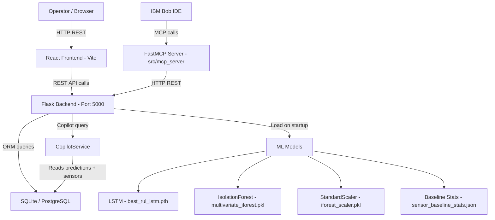

# Architecture

## System Architecture



## Components

| Component | Technology | Responsibility |
|---|---|---|
| Frontend | React 18 + Vite + TailwindCSS | Fleet dashboard, asset health, copilot UI, reports |
| Backend API | Flask 3.0 + Waitress | REST API, CSV ingestion, ML pipeline orchestration, copilot |
| ML — RUL | PyTorch LSTM (2 layers, hidden=64) | Predicts remaining useful life from 30-cycle sensor sequence |
| ML — Health | scikit-learn Isolation Forest (100 estimators) | Per-sensor anomaly detection against healthy baseline |
| Mission Engine | Python business logic in ReadinessResult model | margin = RUL − duration, SAFE/MARGINAL/CRITICAL decision |
| Database | SQLAlchemy + SQLite / PostgreSQL | Assets, sensor_readings, predictions, sensor_analysis, readiness_results, missions |
| Copilot | Python keyword router + template engine | Evidence-grounded NL answers from DB values — no LLM |
| MCP Server | FastMCP (Python mcp SDK) | Five IBM Bob tools calling Flask API |

## Data Flow

### Upload Flow

1. Operator uploads CSV file via browser header upload button
2. `DataController.process_csv_upload()` parses CSV (handles comma-separated, space-separated, and raw CMAPSS format with automatic header assignment)
3. `DatasetRepository.ingest_sensor_data()` creates/updates `Asset` rows and bulk-inserts `SensorReading` rows per engine (idempotent — duplicate cycles are skipped)
4. A background thread is spawned for each engine that received new data
5. Background thread calls `PipelineService.analyze_engine()` for each engine

### ML Inference Flow

1. `SensorRepository.get_readings_for_engine()` fetches all readings ordered by `time_cycles ASC`
2. Readings are converted to a pandas DataFrame with 14 smooth sensor columns
3. **RUL path:** last 30 cycles extracted (zero-padded if fewer) → LSTM → scalar RUL ≥ 0
4. **Health path:** last 5 cycles → IForest.predict() + decision_function() → persistence, slope, norm_dev computed per sensor → NORMAL / DEGRADING / ABNORMAL / UNKNOWN
5. `AnalysisRepository.save_analysis()` writes one `Prediction` row + 14 `SensorAnalysis` rows

### Mission Readiness Flow

1. Frontend calls `POST /api/v1/mission/readiness` with `{engine_id, mission_duration}`
2. `MissionController` creates or updates a `Mission` row
3. `PipelineService.evaluate_mission_readiness()` reads the latest `Prediction`
4. Computes: `margin = rul - mission_duration`, `risk_flag` (SAFE/MARGINAL/CRITICAL), `score` (0-100), `recommendation` (templated string)
5. `ReadinessResult` saved to DB; response returned with `rul_assessment`, `current_health`, `combined_assessment`

### Copilot Flow

1. User types a natural-language question in the UI (or Bob calls `ask_copilot` MCP tool)
2. `POST /api/v1/copilot/query` receives `{engine_id, question}`
3. `CopilotController` validates input, delegates to `CopilotService`
4. `CopilotService` fetches latest prediction, readiness, and sensor analyses from DB
5. Question text is matched against keyword sets → response handler selected
6. Response handler builds a templated answer string citing only real DB values
7. `{answer, evidence, engine_id}` returned — `evidence` contains the raw fields cited

### IBM Bob MCP Flow

1. Bob user asks: "Which engines need immediate attention?"
2. Bob selects the `list_high_priority_engines` tool (FastMCP server)
3. FastMCP server calls `GET /api/v1/engines/` then `POST /api/v1/mission/readiness` for each engine
4. Filters for `maintenance_priority == HIGH`, returns structured list
5. Bob presents the result to the user with its own explanation

## Database Schema

```
assets (id, unit_number, name, asset_type, status, total_cycles, created_at, updated_at)
    │
    ├── sensor_readings (id, asset_id FK, unit_number, time_cycles, sensor_2..21_smooth,
    │                    rul, rul_clipped, predicted_failure_TTE, mission_duration,
    │                    margin_of_safety, critical_overlap_risk, recorded_at)
    │
    ├── missions (id, asset_id FK, mission_name, mission_type, mission_duration, status)
    │       │
    │       └── readiness_results (id, prediction_id FK, mission_id FK, readiness_score,
    │                              risk_flag, predicted_failure_TTE, mission_duration,
    │                              margin_of_safety, critical_overlap_risk, recommendation)
    │
    └── predictions (id, asset_id FK, prediction_cycle, rul_predicted, rul_clipped,
                     predicted_failure_TTE, model_version, predicted_at)
              │
              └── sensor_analysis (id, prediction_id FK, sensor_name, state,
                                   anomaly_score, persistence, slope,
                                   normalized_deviation, degradation_direction)
```

## ML Model Details

### LSTM — RUL Prediction

| Parameter | Value |
|---|---|
| Architecture | 2-layer LSTM + FC head (64→32→1) |
| Input shape | (batch, 30, 14) |
| Feature channels | 14 smoothed sensor readings |
| Dropout | 0.2 between layers |
| Training data | NASA C-MAPSS FD001 (100 engines) |
| Cross-validation | 5-fold Group K-Fold (grouped by engine) |
| Optimal epochs | 7 (determined from CV) |
| Validation MAE | 10.05 cycles |
| Validation RMSE | 13.38 cycles |
| Validation R² | 0.897 |
| Test MAE | ~11.3 cycles |
| Test R² | ~0.865 |

### Isolation Forest — Sensor Health

| Parameter | Value |
|---|---|
| Estimators | 100 |
| Contamination | 0.01 |
| Training reference | Healthy observations only (RUL > 100) |
| Temporal window | 5 cycles |
| Persistence threshold | 0.60 (3 of 5 cycles anomalous) |
| Strong deviation threshold | 3.0 σ from healthy mean |
| Output states | NORMAL, DEGRADING, ABNORMAL, UNKNOWN |

## Security Considerations

- No secrets committed to repository; `.env` is in `.gitignore`
- CORS is configured via `FRONTEND_ORIGIN` environment variable (defaults to `*` for development)
- SQLite database (`app.db`) is in `.gitignore` — not committed
- No authentication layer is implemented (demo system — add auth before production use)
- All ML model weights are pre-trained; no user data is used for training at runtime

## Scalability Notes

- The Flask backend is stateless beyond the SQLite connection; horizontal scaling is possible with PostgreSQL via `DATABASE_URL`
- The LSTM and IForest are loaded once at startup via singleton `ModelHandler` — no per-request model loading overhead
- Background thread approach for analysis can be replaced with a task queue (Celery + Redis) for production fleet sizes
- The MCP server is a thin HTTP wrapper; it scales independently of the Flask API
